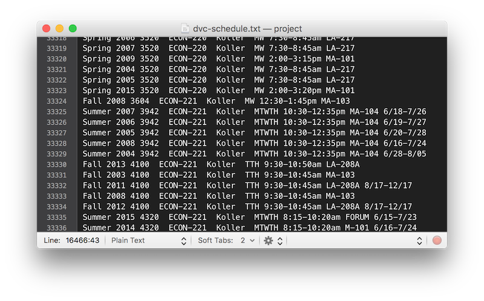
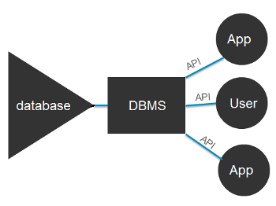
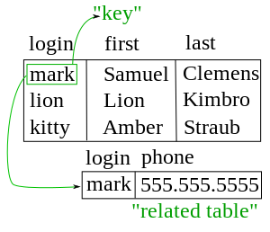
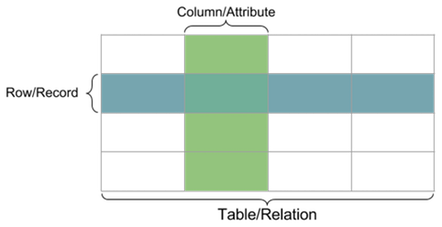
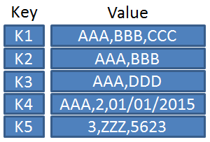
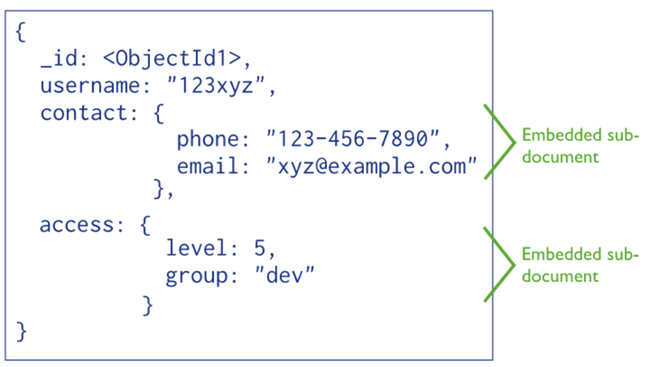

class: middle, center

# intro-db

---

# Agenda

1. Introduction with example
2. Types of databases
    - Relational and non relational
    - SQL
3. Workshop

---

# An Example



---

# An Example

- Problem: storing information about 70,000 lines worth of DVC courses in a text file is inefficient, hard to manage, and slow at insertion, updating, and retrieval

- Parsing the file, then storing the information in data structures such as hash tables is not great, becuase all that information is stored in RAM

- Facebook stores 300 PB of data, an impossible amount to store in RAM

- Updating information requires writing to the file

- Many applications may want to access the data at one time

---

# Introduction

- Understanding databases is a big plus when finding internships - many ask for some knowledge of SQL
- Database Management Systems (DBMS) - Software that allows access to a database
- "Database" may refer to the both the data and the DBMS
- DBMSs structure data according to different models
- DBMSs use different querying languages to access data
	- SQL is the most popular, and is used with many DBMSs
	- Others use their own query languages



---

# Relational Databases

- Use tables of columns and rows to represent data
	- Relate tables together using keys
	- Most use SQL (Structured Query Language)
	- Not very hip
	- Examples: Oracle, MySQL, SQLite

 

---

# NoSQL Databases

- A broad term referring to databases that do not use the relational table model

- Key-Value Stores
	- Act similarly to a hash table
	- Records can hold different types of data
	- Examples: Redis, Amazon DynamoDB



---

# NoSQL Databases
- Document Stores 
	- Similar to key-value stores - items may have different structures
	- can have a nested structure, like JSON
	- useful for holding arrays
	- Examples: MongoDB, RethinkDB



---

# Workshop Setup

1. Sign up at [heroku.com](https://www.heroku.com)
2. Grab the heroku toolbelt at [toolbelt.heroku.com](https://toolbelt.heroku.com)
    - If on Mac, `brew install heroku-toolbelt`

```bash
$ heroku login
Enter your Heroku credentials.
Email: jesse@example.com
Password (typing will be hidden):
Authentication successful.

$ mkdir intro-db
$ cd intro-db
$ git init
Initialized empty Git repository in ./intro-db/.git/

$ heroku create
Creating app... done, stack is cedar-14
https://***.herokuapp.com/ | https://git.heroku.com/***.git
```

---

# Workshop Setup

- Create the database
    
    ```bash
    $ heroku addons:create heroku-postgresql:hobby-dev
    Creating postgresql-trapezoidal-55564... done, (free)
    Adding postgresql-trapezoidal-55564 to ***... done
    Setting DATABASE_URL and restarting ***... done, v3
    Database has been created and is available
     ! This database is empty. If upgrading, you can transfer
     ! data from another database with pg:copy
    Use `heroku addons:docs heroku-postgresql` to view documentation.
    ```

- Download data

    ```bash
    $ heroku run bash
    Running bash on ***.... up, run.7217
    ~ $ wget -O StateNames.csv https://www.dropbox.com/s/s11x9cj29ct9clw/StateNames.csv?dl=1
    ...
    ...
    Saving to: 'StateNames.csv'

    100%[=================================>] 154,696,176 24.9MB/s   in 5.1s

    2016-04-07 20:37:54 (29.2 MB/s) - 'StateNames.csv' saved [154696176/154696176]
    ```

---

# Workshop Setup

- Connect to the database

    ```bash
    ~ $ psql $DATABASE_URL
    Running psql $DATABASE_URL on ***.... up, run.1083
    psql (9.5.1, server 9.4.7)
    SSL connection (protocol: TLSv1.2, cipher: ..., bits: 256, compression: off)
    Type "help" for help.
    d2bh5qbs8qns39=> 
    ```

- Create the table

    ```sql
    => CREATE TABLE names (
    id int,
    name varchar(50),
    year int,
    gender varchar(1),
    state varchar(20),
    count int
    );
    ```
    
- Import data

    ```sql
    => \copy names FROM './StateNames.csv' WITH CSV;
    COPY 5647426
    ```

---

# Workshop

Structure of database

```sql
=> \d
            List of relations
 Schema | Name  | Type  |     Owner
--------+-------+-------+----------------
 public | names | table | cjbawbbpgwxjuc
(1 row)

=> \d names
            Table "public.names"
 Column |         Type          | Modifiers
--------+-----------------------+-----------
 id     | integer               |
 name   | character varying(50) |
 year   | integer               |
 gender | character varying(1)  |
 state  | character varying(20) |
 count  | integer               |
```

---

# Workshop

Sample queries

```sql
=> SELECT * FROM names WHERE  name='Jesse' and state='CA' and year=1996;
   id   | name  | year | gender | state | count
--------+-------+------+--------+-------+-------
 491828 | Jesse | 1996 | F      | CA    |    28
 658580 | Jesse | 1996 | M      | CA    |  1191
(2 rows)

=> SELECT * FROM names WHERE year=1996 ORDER BY count DESC LIMIT 5;
   id    |    name     | year | gender | state | count
---------+-------------+------+--------+-------+-------
  658530 | Daniel      | 1996 | M      | CA    |  4706
  658531 | Jose        | 1996 | M      | CA    |  4645
  658532 | Michael     | 1996 | M      | CA    |  4352
  658533 | David       | 1996 | M      | CA    |  3999
  658534 | Christopher | 1996 | M      | CA    |  3945
(5 rows)

=> SELECT SUM(count) FROM names where year=1996;
   sum
---------
 3224919
(1 row)
```
